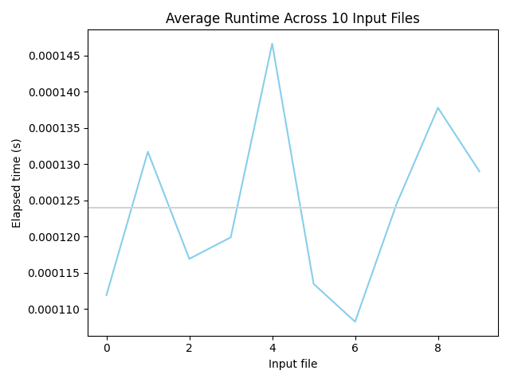

# Programming Assignment 3: Highest Value Longest Common Subsequence

COP4533 - Algorithm Abstraction and Design


## Author

- Preston Hemmy (31020809)


## Setup

Requires Python 3.8+ with matplotlib:

```bash
python -m venv venv
source venv/bin/activate
pip install matplotlib
```


## Running the algorithm

Executing the following prints to the console the maximum value and the corresponding subsequence on
the input `data/<input-file>` and writes out to the `data/` directory.

```bash
python src/hvlcs.py <input-file>

# example
python src/hvlcs.py example.in
```


## Benchmarking

The following executes an empirical runtime comparison across the ten `test*.in` input files averaged
over 1000 trials for each input file and displaying a `matplotlib` plot of the results.

```bash
python src/benchmark.py
```


### Empirical Comparison




### Recurrence Relation

Define $OPT(i, j)$ as the maximum total value of a common subsequence of strings $A[1..i]$ and 
$B[1..j]$, where value is the sum of per-character values. Let $v(c)$ denote the value of some
character $c$. Then, we have the following recurrence.

$$
OPT(i, j) = 
\begin{cases} 0 & \text{if } i = 0 \text{ or } j = 0 \\ 
\max\{OPT(i-1, j),\ OPT(i, j-1)\} & \text{if } A[i] \neq B[j] \\ 
\max\{v(A[i]) + OPT(i-1, j-1),\ OPT(i-1, j),\ OPT(i, j-1)\} & \text{o.w.} 
\end{cases}
$$

This recurrence handles the two analogous base cases where either $i = 0$ or $j = 0$, in which case
the longest common subsequence is zero-length and has a maximum value of zero. It also handles both
recursive cases where either character $c \notin \mathcal{O}$ (where $\mathcal{O}$ is an optimal
subsequence) or $c \in \mathcal{O}$. Assume $A = a_1 \cdots a_m$ and $B = b_1 \cdots b_n$. In the case
of $c \notin \mathcal{O}$, we either discard $a_i$ and recurse on $A[1..i - 1]$ and $B[1..j]$ or we
discard $b_j$ and recurse on $A[1..i]$ and $B[1..j - 1]$, where the decision is made conditioned on
the selection which yields the maximum value. For the case where $c \in \mathcal{O}$, that is $c =
 a_i = b_j$ is selected in the optimal subsequence, we increase the total value by $v(c) = v(a_i) =
 v(b_j)$ and recurse on $A[1..i - 1]$ and $B[1..j - 1]$ or we recurse on $A[1..i - 1]$, $B[1..j]$
or $A[1..i]$, $B[1..j - 1]$, conditioning on the selection which yields the maximum value as before.
Thus, the recurrence always yields the correct output, $\forall i \in 0, \cdots, m$, $\forall j \in 
 0, \cdots, n$.


### Pseudocode and Running Time Analysis

Assuming the dictionary `v(c)` is computed ahead of time and made global, we have the following 
pseudocode which computes the highest value LCS on strings $A$ and $B$

```
Compute-Opt(m, n, A, B):
    Array M[0...m, 0...n]
    Initialize M[0, j] = 0 for j = 0, ..., n
    Initialize M[i, 0] = 0 for i = 0, ..., m
    
    For i = 1, 2, ..., m
        For j = 1, 2, ..., n
            If A[i] = B[j] then
                M[i, j] = max{ v(A[i]) + M[i−1, j−1], M[i−1, j], M[i, j−1] }
            Else
                M[i, j] = max{ M[i−1, j], M[i, j−1] }
            Endif
        Endfor
    Endfor

    Return M[m, n]
```

Since we must fill the array `M` of size $(m + 1)$ x $(n + 1)$ and since each entry is filled in
constant time, `Compute-Opt` has running time $O(mn)$
